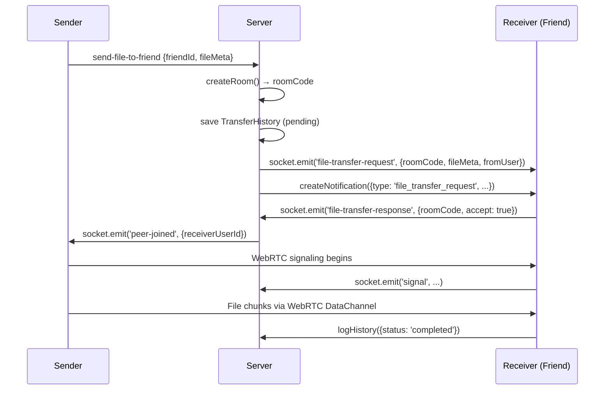

# Low-Click Friend-to-Friend File Transfer Architecture

## Current Flow (High Friction)

1. Sender: Select file → Get room code → Copy/share code
2. Receiver: Open app → Go to Receive tab → Paste code → Join

## Target Flow (Low Friction)

1. Sender: Click friend → Select file → Send (2-3 clicks)
2. Receiver: Get notification → Click "Accept" (1 click) OR auto-accept

---

## Architecture Design

### 1. Data Model Extensions

**Notification Type Addition** (backend/models/Notification.js)

```javascript
type: {
  enum: [
    "friend_request",
    "friend_accepted",
    "file_transfer_request",
    "file_transfer_accepted",
    "file_transfer_rejected",
  ];
}
```

**Transfer Request Payload**

```javascript
{
  type: 'file_transfer_request',
  fromUserId: ObjectId,
  fromUserName: String,
  roomCode: String,
  fileName: String,
  fileSize: Number,
  fileType: String,
  password: String (optional),
  timestamp: Date
}
```

### 2. Backend Changes

#### A. New Socket Events

- `send-file-to-friend` - Sender initiates transfer to specific friend
- `file-transfer-request` - Server pushes to recipient
- `file-transfer-response` - Recipient accepts/rejects
- `friend-online-status` - Track friend presence

#### B. New REST Endpoint (optional, for non-socket fallback)

- `POST /api/transfers/initiate-to-friend` - Create room + notify friend

#### C. Room Creation Logic

- Auto-generate room code
- Store `senderId`, `intendedReceiverId`, `fileMeta`
- Mark room as `pending` until receiver joins

### 3. Frontend Changes

#### A. FriendsView.jsx - Add "Send File" Action

- Each friend row gets a "📤 Send File" button
- Clicking opens file picker directly (bypasses Sender tab)
- Or: Navigate to Sender tab with `preselectedFriendId` prop

#### B. Sender.jsx - Friend-Aware Mode

- Accept `preselectedFriendId` prop
- If set: Skip room code display, show "Sending to [Friend Name]..."
- Auto-call `createRoom(file, userId, password, callback)` with friend context

#### C. NotificationBell.jsx - Handle Transfer Requests

- New notification type: `file_transfer_request`
- Render with "Accept" / "Decline" buttons
- On Accept: Navigate to Receiver tab with `initialCode` pre-filled + auto-join

#### D. Receiver.jsx - Auto-Join Mode

- Accept `autoJoin` prop
- If `initialCode` + `autoJoin`: Immediately call `handleJoin(code)`

### 4. Flow Sequence Diagram



### 5. UX Details

#### Sender Side

- FriendsView: Each friend row → "Send File" button → native file picker
- After file picked: Show toast "Sending to [Name]..." with cancel option
- No room code copy/paste needed

#### Receiver Side

- Notification appears in bell + optional browser push notification
- Notification card: "📁 [Name] wants to send [filename] (2.3 MB)"
- Buttons: [Accept] [Decline]
- Accept → Auto-navigate to Receive tab → Auto-join room → Progress bar appears

#### Optional: Auto-Accept for Trusted Friends

- User setting: "Auto-accept files from [friend]"
- If enabled: Skip notification click, auto-join immediately
- Security: Only for mutually accepted friends, optional password still prompted

### 6. Implementation Priority

| Phase | Task                                             | Effort |
| ----- | ------------------------------------------------ | ------ |
| 1     | Add `file_transfer_request` notification type    | Low    |
| 2     | Backend socket handler for `send-file-to-friend` | Medium |
| 3     | FriendsView "Send File" button + file picker     | Low    |
| 4     | Sender.jsx friend-aware mode                     | Low    |
| 5     | NotificationBell transfer request handling       | Medium |
| 6     | Receiver.jsx auto-join mode                      | Low    |
| 7     | Auto-accept setting (optional)                   | Low    |

### 7. Security Considerations

- Validate friendship exists before allowing transfer
- Rate limit transfer requests per user
- Password protection still works (sender sets, receiver enters)
- Room expires if not joined within 5 minutes
- File size limits enforced

### 8. Backward Compatibility

- Existing room-code flow unchanged
- New flow is additive
- No breaking changes to current API
